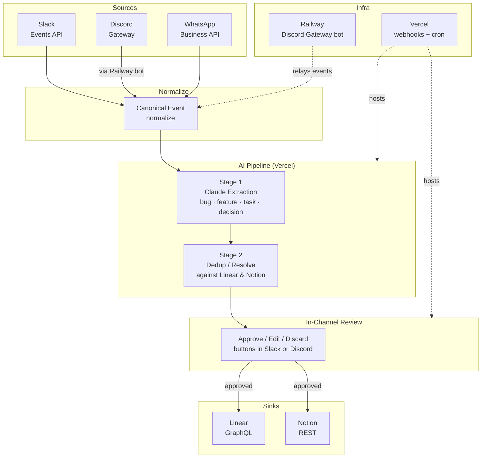

# Conversation to Action

**Turn messy Slack, Discord, and WhatsApp threads into structured work items in Linear and Notion — without copy-pasting or losing context.**

---

## Architecture



> **Vercel** runs the Next.js app: webhook receivers, the AI pipeline cron, and the review interaction handlers.  
> **Railway** hosts the persistent Discord Gateway bot that stays connected over WebSocket and forwards events to Vercel via HTTP.

---

## Screenshots

### Live Feed
Real-time feed of extracted items — bugs, features, tasks, and decisions — with confidence scores, status badges, and dedup matches.


### Item Detail
Full extraction view with evidence quotes from the source conversation, dedup analysis, and suggested labels.


### Stats Dashboard
Pipeline metrics: approval rate, average confidence, and breakdowns by type and status.


### Connection Management
BYOK setup — connect your own Slack, Discord, WhatsApp, Linear, and Notion accounts with encrypted credentials.


---

## Features

- **Three source connectors** — Slack Events API, Discord Gateway, WhatsApp Business API
- **Two sink connectors** — Linear (GraphQL) and Notion (REST)
- **Two-stage AI pipeline** — Stage 1 extracts candidates; Stage 2 deduplicates and resolves against your existing backlog
- **Decisions as first-class items** — not just tasks; explicit approvals and choices are captured as `decision` type
- **In-channel review** — approve, edit, or discard extracted items directly from interactive buttons inside the same Slack or Discord message
- **Dedup against existing backlog** — keyword similarity match; creates new items or updates existing ones
- **BYOK (Bring Your Own Keys)** — your API keys are encrypted at rest with AES-256-GCM and never leave your instance
- **Real-time dashboard** — live feed of extracted items powered by Supabase Realtime
- **Stats page** — precision metrics per source and item type
- **Async processing** — events are staged to Supabase; a per-minute cron processes them in batches, respecting Slack's 3-second webhook rule

---

## Quick Start

### Prerequisites

- Node.js 18+
- A [Supabase](https://supabase.com) project
- API keys for whichever sources and sinks you want to connect (Slack, Discord, WhatsApp, Linear, Notion, Anthropic)

### Steps

1. **Clone the repo**

   ```bash
   git clone https://github.com/martin-minghetti/conversation-to-action.git
   cd conversation-to-action
   ```

2. **Install dependencies**

   ```bash
   npm install
   ```

3. **Run the Supabase migration**

   ```bash
   # Install Supabase CLI if needed: https://supabase.com/docs/guides/cli
   supabase db push
   ```

4. **Configure environment variables**

   ```bash
   cp .env.example .env.local
   # Fill in: NEXT_PUBLIC_SUPABASE_URL, NEXT_PUBLIC_SUPABASE_ANON_KEY,
   # SUPABASE_SERVICE_ROLE_KEY, ANTHROPIC_API_KEY, ENCRYPTION_KEY
   ```

5. **Start the development server**

   ```bash
   npm run dev
   ```

6. **Add your first connection**

   Open [http://localhost:3000/settings](http://localhost:3000/settings) and add a source (Slack, Discord, or WhatsApp) and a sink (Linear or Notion).

7. **Start chatting**

   Talk in any connected channel. Within a minute, extracted items will appear in the dashboard. Your team will see an in-channel review message with action buttons.

---

## How It Works

### Stage 1 — Extraction

When a message lands in a connected channel, it is normalized into a canonical event and staged in Supabase. Every minute, a Vercel cron job picks up unprocessed events and groups them by thread. Each thread is sent to **Claude Sonnet** with a structured prompt that identifies four item types: `bug`, `feature`, `task`, and `decision`. The model returns a JSON array with title, description, owner, evidence quotes, confidence score (0–100), and suggested labels.

### Stage 2 — Dedup and Resolution

Each candidate item is then sent to your configured sink (Linear or Notion) for a keyword search against the existing backlog. The stage-2 resolver computes string similarity between the candidate title and each search result. If a close match is found (similarity ≥ 0.7), the item is flagged as `update`; if two close matches compete, it becomes `ambiguous`; otherwise it defaults to `create`. This prevents duplicates without requiring embeddings or vector infrastructure.

### In-Channel Review

After resolution, a review message with interactive buttons is posted back into the original Slack channel or Discord thread. Each team member can **approve**, **edit the title/description**, or **discard** each item individually — without switching tools. Only approved items are pushed to Linear or Notion.

### Push to Sink

Approved items are written to the configured sink via the connector API. If the dedup action is `update`, the existing issue is patched with the new description and evidence links. If it is `create`, a new issue or page is created. Source message permalinks are attached as evidence comments or page blocks.

---

## Cost

Processing a typical thread of 10–20 messages through the two-stage pipeline costs approximately **$0.03–0.05** with Claude Sonnet (as of April 2025).

---

## Tech Stack

| Layer | Technology |
|---|---|
| Framework | Next.js 15 (App Router) |
| Language | TypeScript |
| AI | Anthropic SDK — Claude Sonnet |
| Database | Supabase (Postgres + Realtime) |
| Discord bot | discord.js (Railway) |
| Styling | Tailwind CSS v4 |
| Deployment | Vercel (app) + Railway (Discord bot) |
| Validation | Zod |

---

## Testing

```bash
npm test        # run all tests once
npm run test:watch  # watch mode
```

62 tests across the full pipeline: extraction, resolution, dedup logic, connector normalizers, crypto utilities, and API route handlers. Tests run in CI on every push via GitHub Actions.

---

## Architecture Decisions

See [DECISIONS.md](DECISIONS.md) for the 9 key trade-off analyses that shaped this project.
